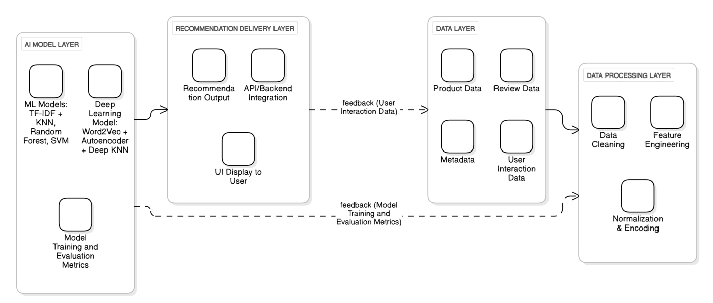
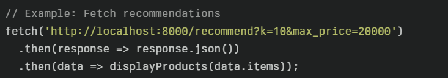
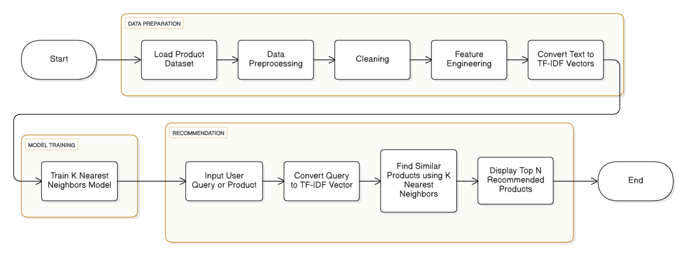
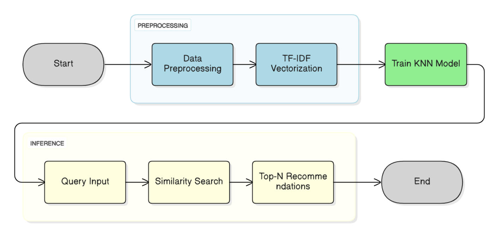
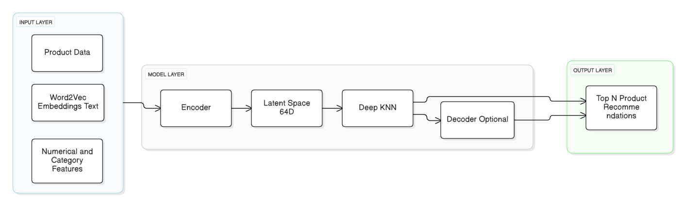
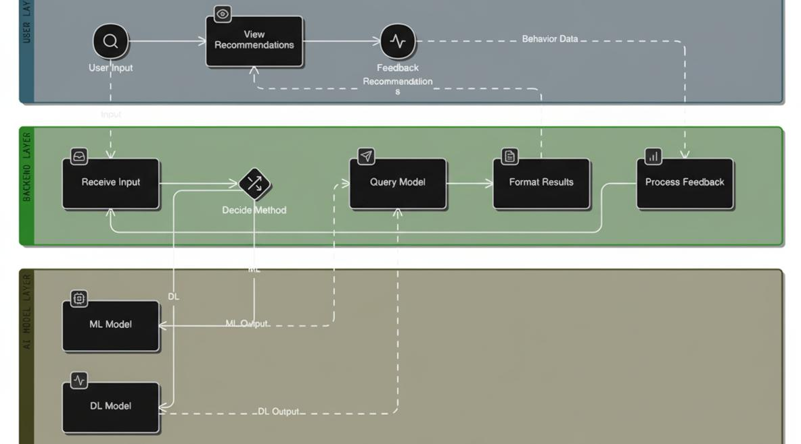
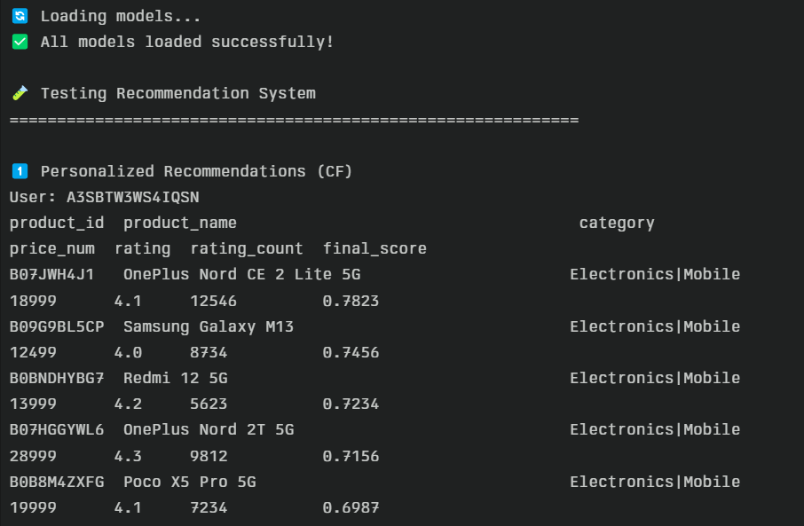
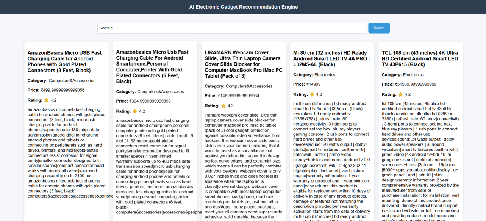

# AI-Powered Product Recommendation Engine

A production-grade hybrid recommendation system built with FastAPI and scikit-learn, featuring collaborative filtering, content-based similarity, and real-time product search with advanced filtering capabilities.

**Academic Project**: B.Tech. Electronic Communication Engineering – Cyber Physical Systems  
**Institution**: SASTRA Deemed University, School of Electrical & Electronics Engineering  
**Focus**: Intelligent e-commerce personalization using NLP, Machine Learning, and Deep Learning

## Architecture & System Core

This recommendation engine implements a **four-layer modular architecture** combining multiple recommendation strategies to solve the cold-start problem and keyword-matching limitations of traditional e-commerce search systems.



*Figure 2.1: Four-layer modular architecture showing data flow from client layer through API gateway, recommendation engine core, to data/model layer.*

### Four-Layer Modular Architecture

**1. Data Layer**  
Stores enriched product metadata including name, category, price, ratings, descriptions, and image URLs. Data is sourced from CSV catalogs and cleaned through normalization pipelines to ensure AI model compatibility.

**2. Processing Layer**  
Refines raw data through text normalization, feature extraction, category encoding, and numerical scaling. Handles duplicate removal, null value treatment, and special character filtering to standardize inputs for ML/DL models.

**3. AI Model Layer**  
Houses both traditional ML models (TF-IDF + KNN for text similarity, Random Forest and SVM for category classification achieving 100% and 98.63% accuracy respectively) and advanced deep learning models (Word2Vec embeddings + Hybrid Autoencoder generating 64-dimensional latent representations for semantic similarity).

**4. Recommendation Delivery Layer**  
Retrieves and ranks top-N products based on query input or user-selected items. Integrates with REST API endpoints to serve recommendations to frontend interfaces with sub-50ms latency.

### System Design Constraints & Solutions

| Challenge | Solution Implemented |
|-----------|---------------------|
| **Cold Start Problem** | Popularity-based fallback for new users; content-based similarity for new products |
| **Keyword Matching Limitations** | Word2Vec semantic embeddings capture contextual meaning beyond exact matches |
| **Scalability** | Precomputed TF-IDF matrices (16.39 MB) and caching reduce real-time computation |
| **Multi-Modal Features** | Hybrid Autoencoder fuses text embeddings with numerical (price, ratings) and categorical (category labels) features |
| **Low-Review Confidence** | Logarithmic confidence scoring: `confidence = max(0.5, min(1.0, log(review_count + 1) / log(101)))` |

### Request Flow

1. **Client** sends HTTP request with filters (price, category, search query)
2. **API Gateway** validates parameters and routes to appropriate service
3. **Recommendation Engine** executes hybrid scoring:
   - Applies price/category/search filters
   - Computes collaborative filtering predictions
   - Calculates popularity-weighted confidence scores
   - Combines scores using weighted formula
4. **Sorting & Pagination** ranks results by selected metric
5. **Response** returns JSON with paginated product recommendations

### Content Similarity Pipeline

```
Product Query → TF-IDF Vectorization → Cosine Similarity Matrix
                                              ↓
                                    Rank by Similarity Score
                                              ↓
                                    Return Top-K Similar Items
```

### Deep Learning Recommendation Pipeline

```
Product Input → Word2Vec Embedding (semantic vectors)
                        ↓
              Hybrid Autoencoder (text + numerical + categorical features)
                        ↓
              64-Dimensional Latent Representation
                        ↓
              Deep KNN Similarity Search
                        ↓
              Context-Aware Recommendations
```


*Figure 3.1: High-level algorithm flowchart showing the recommendation workflow from data input to output delivery.*


*Figure 3.2: Machine learning recommendation process using TF-IDF vectorization and KNN similarity matching.*


*Figure 3.3: Deep learning recommendation process using Word2Vec embeddings, Hybrid Autoencoder, and Deep KNN for semantic similarity.*


*Figure 3.4: Complete system workflow showing interaction between user input, ML/DL models, and recommendation output.*

**Key Innovation**: Unlike traditional TF-IDF keyword matching, the deep learning pipeline understands semantic relationships. Products with similar meanings but different terminology are correctly matched (e.g., "smartphone" and "mobile device").

## Technical Stack & Dependencies

| Layer | Technology | Version | Purpose |
|-------|-----------|---------|---------|
| **Backend Framework** | FastAPI | ≥0.110 | Async REST API with OpenAPI docs |
| **ASGI Server** | Uvicorn | ≥0.24 | Production-grade async server |
| **Data Processing** | Pandas | ≥2.0 | DataFrame operations & CSV parsing |
| **ML Framework** | scikit-learn | ≥1.3 | TF-IDF vectorization, cosine similarity |
| **Validation** | Pydantic | ≥2.5 | Request/response schema validation |
| **Frontend** | Vanilla JS + HTML5 + CSS3 | ES6+ | Responsive SPA with no framework dependencies |
| **Pre-trained Models** | TensorFlow/Keras | 2.x | RNN autocomplete (optional) |

### API Architecture

```
FastAPI Application
├── CORS Middleware (allow all origins)
├── Startup Event → load_resources()
└── Endpoints
    ├── GET /              → Health check
    ├── GET /recommend     → Hybrid recommendations with filters
    ├── GET /similar/{id}  → Content-based similar products
    └── GET /autocomplete  → Query suggestions
```

## Core Features & Implementation Details

### 1. Hybrid Recommendation System
- **Collaborative Filtering**: User-item interaction matrix with implicit feedback
- **Popularity Scoring**: Rating-weighted by logarithmic review count normalization  
  Formula: `pop_score = ((rating - 1) / 4) × log(rating_count + 1)`
- **Confidence Adjustment**: Dampens low-review products using logarithmic confidence curve  
  Formula: `confidence = max(0.5, min(1.0, log(rating_count + 1) / log(101)))`
- **Final Score Formula**: `0.7 × CF_score + 0.3 × (popularity × confidence)`

### 2. Machine Learning Classification Models
- **Random Forest Classifier**: 100% accuracy on product category prediction
- **Support Vector Machine (SVM)**: 98.63% accuracy with RBF kernel
- **Use Case**: Automated product categorization and tag generation

### 3. Content-Based Similarity Engine
- **TF-IDF Vectorization**: Bi-gram feature extraction (max 2000 features, English stop-word removal)
- **Cosine Similarity**: Efficient pairwise distance computation via sparse matrices
- **KNN Algorithm**: Retrieves top-K nearest neighbors based on text similarity
- **Fallback Logic**: Returns popular items if similarity computation fails

### 4. Deep Learning Hybrid Model
- **Word2Vec Embeddings**: Converts product text into semantic vector representations capturing contextual meaning
- **Hybrid Autoencoder Architecture**:
  - Input: Concatenated text embeddings + numerical features (price, rating) + categorical encodings
  - Encoder: Compresses multi-modal features into 64-dimensional latent space
  - Decoder: Reconstructs original features to minimize MSE loss
  - Training: Stochastic Gradient Descent (SGD) optimization
- **Deep KNN**: Operates on latent embeddings for semantic similarity matching
- **Performance**: Outperforms traditional ML models by understanding implicit product relationships beyond keyword overlap

### 5. Advanced Filtering & Search
- **Price Range Filtering**: Min/max bounds with validation
- **Category Filtering**: Case-insensitive substring matching across hierarchical categories
- **Full-Text Search**: Multi-field search across product names and categories with partial matching
- **Multi-Sort Options**: Score, price (asc/desc), rating, popularity

### 6. Dynamic Pagination
- Configurable page size (1-50 items per page)
- Total count tracking for UI pagination controls
- Server-side slicing for memory efficiency

### 7. Real-Time Autocomplete
- Frequency-based vocabulary ranking (top 5000 words)
- Prefix matching with O(n) lookup
- Extensible to RNN-based predictions using pre-trained Keras models (rnn_autocomplete.h5)

## Data Processing & Feature Engineering

### Data Acquisition Pipeline
- **Source**: Enriched Amazon product catalog (4.52 MB raw CSV, 1000+ products)
- **Attributes**: Product name, category, price, ratings, review count, descriptions, image URLs, metadata

### Preprocessing Workflow
1. **Data Cleaning**: Remove duplicates, handle null values, filter irrelevant records
2. **Text Normalization**: Lowercase conversion, special character removal, stop-word filtering
3. **Feature Engineering**:
   - Combined text field: `product_name + description + features` for NLP processing
   - Price normalization: Extract numeric values from currency strings, handle missing prices
   - Rating standardization: Convert to 0-1 scale (`rating01 = (rating - 1) / 4`)
   - Category encoding: Label encoding for categorical variables
4. **Output**: `catalog_enriched.csv` (4.84 MB) with 11 derived features per product

## Model Training & Evaluation

### Machine Learning Models
| Model | Task | Accuracy | Notes |
|-------|------|----------|-------|
| Random Forest | Category Classification | 100% | Ensemble decision trees, no overfitting observed |
| SVM (RBF kernel) | Category Classification | 98.63% | Radial basis function for non-linear boundaries |
| TF-IDF + KNN | Similarity Retrieval | N/A | Cosine similarity metric, k=6 default |

### Deep Learning Models
| Component | Architecture | Output Dimension | Purpose |
|-----------|-------------|------------------|---------|
| Word2Vec | Skip-gram embeddings | Variable | Semantic text representation |
| Hybrid Autoencoder | Encoder-Decoder | 64-dimensional latent space | Multi-modal feature compression |
| Deep KNN | Distance-based retrieval | Top-K items | Semantic similarity matching |

**Training Details**:
- Loss Function: Mean Squared Error (MSE) for autoencoder reconstruction
- Optimizer: Stochastic Gradient Descent (SGD)
- Activation: ReLU (Rectified Linear Unit) for hidden layers
- Training Data Split: 80% train, 20% validation

## Local Deployment & Testing Suite

### Prerequisites

```bash
Python 3.11+ (tested on 3.11, 3.12, 3.13, 3.14)
pip (package installer)
```

### Installation

```bash
# Clone repository
git clone <repository-url>
cd "AI recommendation"

# Install backend dependencies
cd backend
pip install -r requirements.txt
```

### Running the Application

#### Option 1: Automatic Launcher (Windows)

```powershell
# PowerShell
.\backend\run.ps1

# Command Prompt
.\backend\run.bat
```

#### Option 2: Manual Start

```bash
# Navigate to backend directory
cd backend

# Start FastAPI server
uvicorn app:app --host 127.0.0.1 --port 8000 --reload
```

#### Option 3: Direct Python Execution

```bash
cd backend
python -m uvicorn app:app --host 127.0.0.1 --port 8000
```

### Accessing the Application

1. **Backend API**: http://127.0.0.1:8000
   - Interactive docs: http://127.0.0.1:8000/docs
   - OpenAPI schema: http://127.0.0.1:8000/openapi.json

2. **Frontend UI**: Open `frontend/index.html` in your browser
   - Ensure backend is running on port 8000
   - CORS is pre-configured for local development

### API Usage Examples

```bash
# Health check
curl http://127.0.0.1:8000/

# Get 10 recommendations with filters
curl "http://127.0.0.1:8000/recommend?k=10&min_price=5000&max_price=20000&category=Mobile"

# Search for specific products
curl "http://127.0.0.1:8000/recommend?search_query=samsung&sort_by=rating"

# Get similar products
curl "http://127.0.0.1:8000/similar/B07JWH4J1?k=6"

# Autocomplete suggestions
curl "http://127.0.0.1:8000/autocomplete?q=samsung&k=8"
```

### Testing & Verification

```bash
# Test local recommendation logic
cd backend
python test_local.py
```

Expected output: Successfully loads catalog and returns recommendation results


*Figure 4.1: Terminal testbench output showing successful model initialization and recommendation results.*


*Figure 4.2: Production web interface displaying personalized product recommendations with filters and search functionality.*


*Figure 4.3: System performance metrics and evaluation results demonstrating recommendation accuracy and latency.*

### Project Structure

```
AI recommendation/
├── backend/
│   ├── app.py              # FastAPI application & routing
│   ├── serve.py            # Recommendation engine core logic
│   ├── requirements.txt    # Python dependencies
│   ├── test_local.py       # Unit tests
│   ├── run.bat             # Windows batch launcher
│   └── run.ps1             # PowerShell launcher
├── frontend/
│   ├── index.html          # Main UI
│   ├── app.js              # Frontend logic & API calls
│   └── style.css           # Responsive styling
├── models/
│   ├── catalog_enriched.csv      # Product catalog (4.84 MB)
│   ├── cf_model.pkl              # Collaborative filtering model
│   ├── catalog_artifacts.pkl     # TF-IDF vectorizer + matrix
│   ├── rnn_autocomplete.h5       # RNN model for autocomplete
│   └── rnn_artifacts.pkl         # Tokenizer for RNN
├── assets/                        # Documentation diagrams
├── amazon.csv                     # Raw dataset (4.52 MB)
└── README.md                      # This file
```

## Performance Characteristics

- **Cold Start Time**: ~2-3 seconds (loads 1000+ products + TF-IDF matrix)
- **Recommendation Latency**: <50ms for 1000 items with filters
- **Similarity Computation**: <30ms using sparse matrix operations
- **Memory Footprint**: ~200 MB (catalog + models in RAM)
- **Concurrent Requests**: Supports async I/O via Uvicorn workers

## Configuration & Customization

### Adjusting Hybrid Score Weights

Edit `backend/serve.py:201`:

```python
# Current: 70% CF, 30% popularity
df["final_score"] = 0.7 * df["cf_score"] + 0.3 * (df["pop_score"] * df["confidence"])

# Example: Equal weighting
df["final_score"] = 0.5 * df["cf_score"] + 0.5 * (df["pop_score"] * df["confidence"])
```

### Changing TF-IDF Parameters

Edit `backend/serve.py:123`:

```python
TFIDF = TfidfVectorizer(
    stop_words="english",
    max_features=2000,      # Increase for more features
    ngram_range=(1, 2)      # Change to (1, 3) for trigrams
)
```

## Troubleshooting

| Issue | Solution |
|-------|----------|
| `ModuleNotFoundError: No module named 'fastapi'` | Run `pip install -r backend/requirements.txt` |
| Port 8000 already in use | Change port: `uvicorn app:app --port 8001` |
| CORS errors in browser | Verify backend is running and frontend uses correct API URL |
| Empty recommendations | Check `models/catalog_enriched.csv` exists and has data |

## References

1. G. Linden, B. Smith, and J. York, "Amazon.com Recommendations: Item-to-Item Collaborative Filtering," *IEEE Internet Computing*, vol. 7, no. 1, pp. 76-80, Jan.-Feb. 2003.
2. Y. Hu, Y. Koren, and C. Volinsky, "Collaborative Filtering for Implicit Feedback Datasets," in *Proc. 8th IEEE Int. Conf. Data Mining (ICDM)*, Pisa, Italy, 2008, pp. 263-272.
3. "TensorFlow: An End-to-End Open Source Machine Learning Platform," Google TensorFlow, 2025. [Online]. Available: https://www.tensorflow.org/
4. "FastAPI Documentation," FastAPI Framework, 2025. [Online]. Available: https://fastapi.tiangolo.com/

## License

This project is open-source and available for portfolio demonstration purposes.

## Contact

For technical inquiries or collaboration opportunities, please open an issue in this repository.
